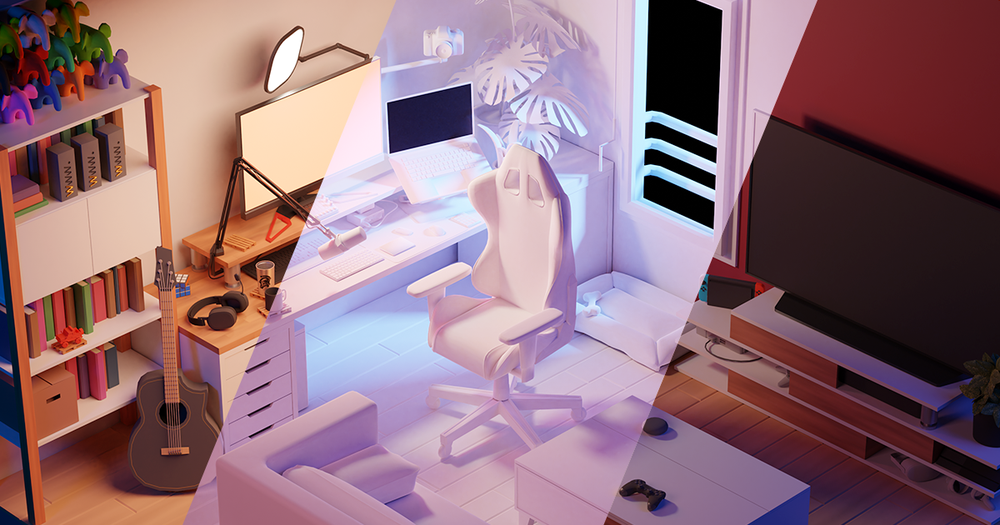

# Mi Habitación en 3D



## Enlaces

- [GitHub](https://github.com/Santiagorodriguezgalviz/Habitacion-3d.git)
- [Demo en vivo](https://my-room-in-3d.vercel.app)

## Configuración

1. Descarga [Node.js](https://nodejs.org/es/download/).
2. Ejecuta los siguientes comandos:

```bash
# Instalar dependencias (solo la primera vez)
npm install

# Iniciar servidor local en localhost:8080
npm run dev

# Compilar para producción en el directorio dist/
npm run build
```
